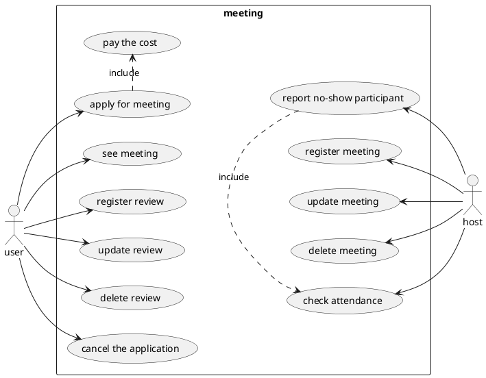

# Frip-demo
프립 데모버전을 만드는 Toy Project
# UseCase

```plantuml
@startuml
left to right direction
skinparam packageStyle rectangle
actor host
actor user
rectangle meeting {
    (register meeting) <-- host
    (update meeting) <-- host
    (delete meeting) <-- host
    (check attendance) <-- host
    (report no-show participant) <-- host
    (report no-show participant) .> (check attendance) : include

    user --> (see meeting)
    user --> (register review)
    user --> (update review)
    user --> (delete review)
    user --> (apply for meeting)
    user --> (cancel the application)
    (apply for meeting) .> (pay the cost) : include

    (see meeting) -[hidden]- (register meeting)
    (register review) -[hidden]- (update meeting)
    (update review) -[hidden]- (delete meeting)
    (delete review) -[hidden]- (check attendance)
}
@enduml
```
# ERD

